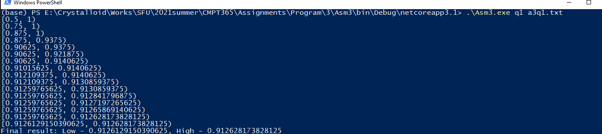
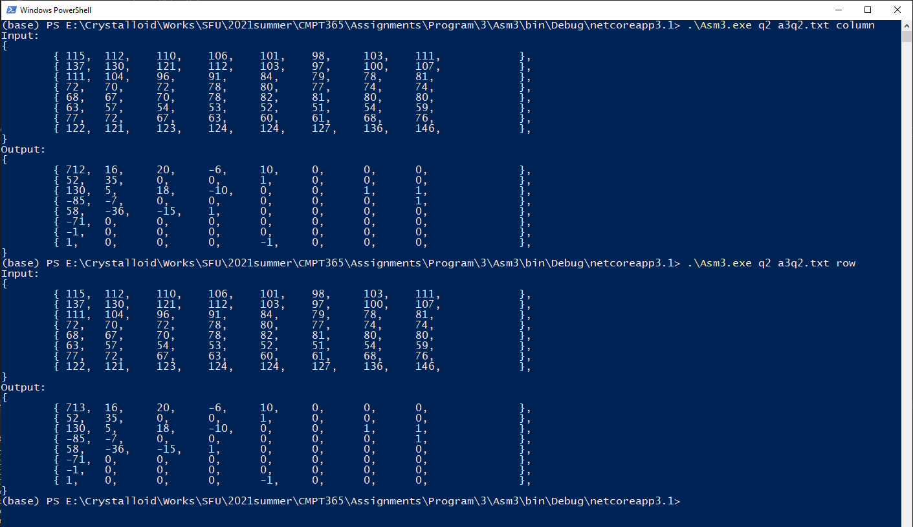

# How to compile:
## Supported Platform:
    Windows10 64-bit
## Prerequisite:
    Microsoft .Net Core SDK 2.1.x
    Microsoft .Net Core SDK 3.1.x
## Command: 
```powershell
dotnet publish -r win-x64 -c Release -p:PublishSingleFile=true --self-contained true
```

# How to run:
    1. Open a Windows Powershell window
    2. Navigate to root directory of Asm2.exe
    3. Running the following command:

        .\Asm.exe <q1|q2> <filename> <column|row>
        
    




# Output:
    If running the program with 'q1' option (first argument), output will print the Arithmetic Coding range table for the given file (second argument). The last line is the final result.
    If running the program with 'q2' option (first argument), output will be the inputed matrix and DCT transformed matrix for the given file (second argument). If the third argument is 'column', program will perform column first DCT transformation. If the third argument is 'row', program will perform row first DCT transformation.